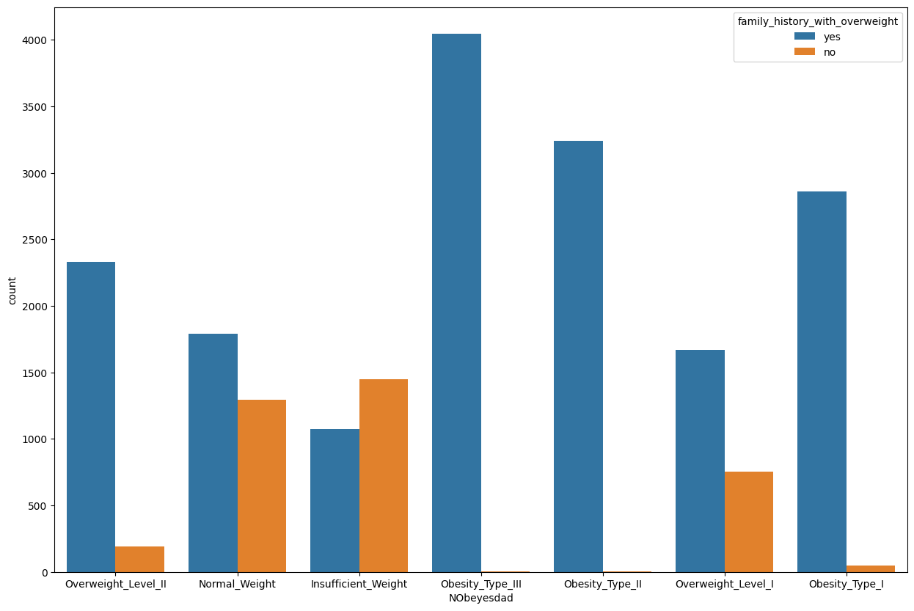

# End to End Machine Learning Project for Obesity Risk Prediction

## Project Overview
This project focuses on the classification of obesity risk of individuals and classified into categories such as 
- Insufficient_Weight : Less than 18.5
- Normal_Weight : 18.5 to 24.9
- Obesity_Type_I : 30.0 to 34.9
- Obesity_Type_II : 35.0 to 39.9
- Obesity_Type_III : Higher than 40
- Overweight_Level_I, Overweight_Level_II takes values between 25 to 29. 

The objective is to effectively identify and categorize obesity types, enabling users to assess their risk of cardiovascular disease. This repository encompasses the end-to-end development of a project that adheres to industry standards

## Dataset
The data has the features describing the user characteristics, physical condition and activities that he perform on daily basis.
Link - <a href="https://www.kaggle.com/competitions/playground-series-s4e2">Dataset</a>

Features:
- Gender
- Age
- Height
- Weight
- family_history_with_overweight : Family history with overweight
- FAVC : Frequent consumption of high caloric food
- FCVC : Frequency of consumption of vegetables
- NCP : Number of main meals
- CAEC : Consumption of food between meals
- SMOKE
- CH2O : Daily Consumption of water
- SCC : Calories consumption monitoring 
- FAF : Frequency of Physical activity
- TUE : Time using technology devices
- CALC : Consumption of alcohol
- MTRANS : Mode of Transportation
- NObeyesdad : User Weight Category
<<<<<<< Updated upstream
=======

Plot of family_history_with_overweight with Target variable:

Requirements:
- pandas
- numpy
- seaborn
- matplotlib
- scikit-learn
- xgboost
- lightgbm
- catboost
- dill
- flask

Project Structure:
1. data_ingestion.py
    - The data is extracted from the source and split into train and test data.
    - The train and test data is stored on <italic>artifacts</italic> folder

2. data_transformation.py
    - ColumnTransformer with numerical and categorical pipeline is built in this file.
    For numerical data:
        - Missing values are imputed with median
        - Scaled using Standard Scaler
    For categorical data:
        - Missing values are imputed with most_frequent
        - Encoded using OneHotEncoder
    - The above transformations are done on the data and return both transformed train and test arrays.

3. model_trainer.py
    - All the classification models are used to train the data.
    - The model evaluation method is created in utils.py and returns the each model Kpi's
    - Hyperparameter Tuning is done on all the models

4. predict_pipeline.py
    - The data from flask app is sent through the prediction pipeline
    - The pipeline loads the saved pickle files and give the prediction for the user input

Files Description:
- artifacts : Contains files extracted from all components such as train.csv, test.csv, and saved pickle files.
- notebook : contains ipynb notebooks
- src : All the project related files are present here such as components and pipeline files.
- templates : The flask app UI files
- app.py - The flask app that runs the program.
- model_evaluation_report.csv - Results of all models.
- model_evaluation_report_tuned.csv - Results of the best model.

Note: The complete implementation details is found at <a href="https://github.com/arunnandam/Obesity-Risk-Prediction/blob/main/Instructions.md">Instructions.md</a>
